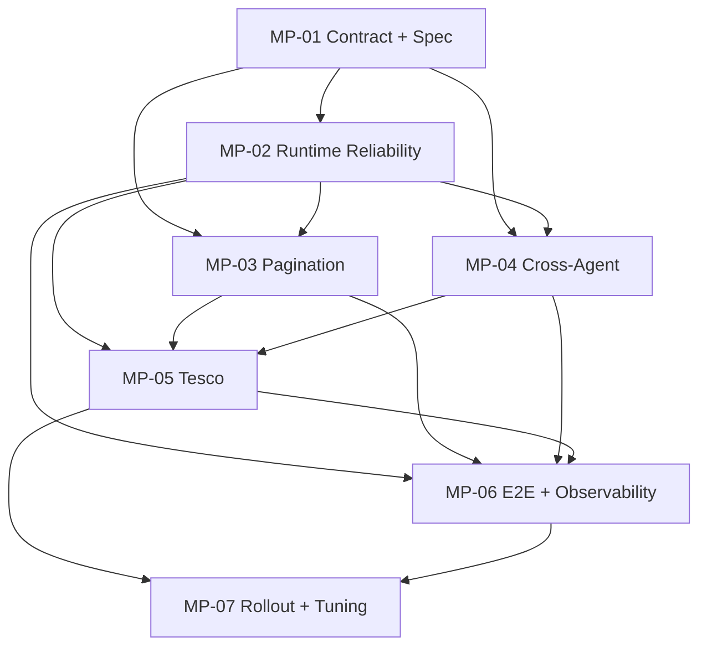

# HYPERPLAN — Universal Reliable Browser Workflows + Tesco Pilot

**ID:** HP-BRW-001
**Status:** in-progress — delivery reconciliation + final ledger gate
**Execution:** started 2026-08-23 after explicit user approval
**Created:** 2026-08-23
**Owner:** itharen3@gmail.com
**Coordinator:** My Assistant
**Progress:** 5/7 Masterplan · 19/21 Subplan verified
**Canonical user input:** `current/feature-requests/browser-workflow-reliability.md`

## 1. Cél

Egy közös, agent-agnosztikus browser-workflow rendszer létrehozása, amelyet bármely AI agent CLI-n vagy
MCP-n keresztül használhat, determinisztikus workflow-contracttal, first-class paginationnel, biztonságos
megszakítás/folytatással és mérésalapú utóhangolással. Az első teljes vertical slice a Tesco keresés →
termékfeloldás → kosár-diff → user approval → utólagos reconciliation út.

## 2. Kiindulási ground truth

- A közös tool projektje létezik: `LIVE-projects/unblockable-browser-handler-tool`.
- ⚠️ **STALE kiinduló állapot:** a tool korábban csak SPEC-fázisban volt. 2026-08-23-ra az implementáció,
  globális CLI, saját MV3 extension és élő read/reconnect transport elkészült.
- A specifikáció már tartalmaz CLI+MCP-t, namespace-eket, action-logot és My Assistant integrációt.
- Explicit gap: általános traversal/pagination contract, minden-agent kompatibilitási mátrix és tuning lifecycle.
- Verifikált Tesco target: `https://bevasarlas.tesco.hu/shop/hu-HU/`.
- Verifikált keresési példa: `query=alpro&inputType=free+text`; az eredmény dinamikus. A 2026-08-23-i végső
  canary 54 találatot adott: 48 az első oldalon, számozott page-2 linkkel.
- A Tesco-kosár nagy-listás pagination/virtualizációja jelenleg **unverified** (a felmért kosár üres volt).
- Első browser-bootstrap időtúllépett, a dokumentált recovery után sikerült → bootstrap/self-heal release-gate.

## 3. Nem alku tárgya

1. **Minden agent:** CLI az univerzális baseline; MCP a natív agent-csatorna; ugyanaz a verziózott contract.
2. **Nincs vak kattintás:** action csak precondition után; success csak postcondition-evidence alapján.
3. **Pagination first-class:** page-link, load-more, infinite-scroll, cursor és virtualized-list.
4. **Idempotencia:** minden write diff-alapú; ismétlés nem dupláz és nem lép tovább vakon.
5. **Checkpoint/resume:** minden traversal- és mutation-lépés folytatható, deduplikált resume tokennel.
6. **Biztonsági gate:** checkout, fizetés, érzékeny adat és CAPTCHA csak action-time user-confirmationnel.
7. **Observability:** invocation, page-state hash, cursor, decision, effect és evidence korrelált action-logban.
8. **Tuning lifecycle:** production failure → redacted fixture → classification → profile-fix → replay → canary.
9. **E2E release-gate:** feature-E2E + cross-feature user-journey, edge/variáns és cleanup kötelező.
10. **Őszinte állítás:** „unblockable” vagy „nulla fingerprint” nem lehet bizonyítatlan garancia.
11. **Single-writer lease:** egy browser/profil/foreground input csatornát egyszerre pontosan egy run mutálhat.
12. **Local execution plane:** távoli agent sem kap közvetlen browser-portot; hitelesített helyi relayen dispatch-el.

## 4. Masterplan ledger

| MP | Név | Subplan | Státusz | Függőség |
|---|---|---:|---|---|
| [MP-01](master-plans/mp-01-contract-and-spec.plan.md) | Contract & Spec Alignment | 3 | ✅ | — |
| [MP-02](master-plans/mp-02-runtime-reliability.plan.md) | Runtime Reliability Core | 3 | ✅ | MP-01 |
| [MP-03](master-plans/mp-03-pagination-traversal.plan.md) | Pagination & Traversal Engine | 3 | ✅ | MP-01; MP-02 contract |
| [MP-04](master-plans/mp-04-cross-agent-distribution.plan.md) | Cross-Agent Distribution | 3 | ✅ | MP-01; MP-02 |
| [MP-05](master-plans/mp-05-tesco-adapter.plan.md) | Tesco Vertical Slice | 3 | 🔍 2/3 | MP-02; MP-03; MP-04 |
| [MP-06](master-plans/mp-06-e2e-observability.plan.md) | E2E, Evals & Observability | 3 | ✅ 3/3 | MP-02..05 |
| [MP-07](master-plans/mp-07-rollout-tuning-certification.plan.md) | Rollout, Tuning & Certification | 3 | 🔄 2/3 | MP-05; MP-06 |

**Státuszok:** ❌ pending · 🔄 in-progress · 🔍 review · ✅ verified · ⚠️ blocked · ❓ decision.

## 5. Függőségi térkép



## 6. Végrehajtási hullámok

| Hullám | Munka | Párhuzamosítható |
|---|---|---|
| A | MP-01 contract/spec amendment | nem |
| B | MP-02 runtime + MP-03 traversal + MP-04 integrations | igen, stabil contract után |
| C | MP-05 Tesco adapter vertical slice | korlátozottan |
| D | MP-06 teljes test/evidence lánc | fixture és adapter shardok igen |
| E | MP-07 staged rollout + tuning + certification | mérési ciklusok sorosan |

## 7. Követelmény-traceability

| User-igény | Elsődleges owner | Bizonyíték |
|---|---|---|
| Minden AI agent használja | MP-01, MP-04 | compatibility matrix + CLI/MCP contract tests |
| Lapozható oldalak/kosár | MP-03, MP-05 | pagination fixture-E2E + large-cart journey |
| Utólagos hangolás | MP-06, MP-07 | tuning corpus + promoted site-profile evidence |
| Tesco `shop/hu-HU` felület | MP-05 | live read-only reconnaissance + adapter fixture |
| Megbízható/determinisztikus működés | MP-02, MP-06, MP-07 | postconditions + resume + two clean passes |

## 8. Közös adat- és vezérlési contract

Minden agent ugyanazt a workflow-envelope-ot fogyasztja:

```text
RunRequest -> CapabilityCheck -> Observe -> Plan -> Traverse/Act -> Verify -> Checkpoint
           -> ApprovalGate (ha kell) -> Resume/Complete -> EvidenceBundle
```

Kötelező azonosítók: `runId`, `requestId`, `consumer`, `namespace`, `workflowId`, `stepId`, `pageCursor`,
`stateHash`, `effectId`, `leaseId`, `evidenceRefs`, `contractVersion`.

## 9. Pagination completion contract

Traversal csak akkor `complete`, ha bizonyított a terminális állapot. Kötelező stop-reason:
`end-of-list | max-items | max-pages | max-duration | no-progress | duplicate-cycle | blocked | error`.
Néma csonkolás tilos; részleges eredmény mindig `partial:true`, resume tokennel és evidence-szel tér vissza.

## 10. Tesco business journey

```text
Organizer shopping read
  -> Tesco search across every result page
  -> product candidate ranking + confidence
  -> user-resolved ambiguities/preferences
  -> existing cart full traversal
  -> desired-vs-actual diff
  -> bounded cart mutations + per-item verification
  -> final cart reconciliation
  -> action-time approval boundary
  -> order/delivery evidence reconciliation
  -> missing/substituted items feedback to Organizer
```

## 11. Release Definition of Done

Hyperplan csak akkor `✅`, ha:

1. 7/7 MP és 21/21 SP `✅`, evidence-linkkel;
2. CLI + MCP ugyanazon contract suite-on zöld, támogatott agent-mátrix 100%;
3. minden pagination modell automata multivariációs feature-E2E-vel zöld;
4. teljes Tesco journey és variánsai automata controlled-fixture E2E-ben zöldek;
5. live Tesco canary read-only; supervised cart-write acceptance evidence megvan;
6. interrupt/resume, session-expiry, duplicate-page, partial-write és layout-drift variáns zöld;
7. nincs checkout/fizetés/CAPTCHA action-time confirmation nélkül;
8. tuning corpus, metrics baseline és profile promotion workflow működik;
9. docs, SKILLS.md, CLI help, MCP capabilities és consumer onboarding egyezik;
10. teljes Hyperplan re-verification **kétszer egymás után 0 hibával** lefutott; bármely hiba reseteli a streaket.
11. concurrent-agent és remote-agent relay journey-k lock-, auth- és cancellation-variánsai zöldek.

## 12. Nyitott, de nem blokkoló tételek

- A nagy Tesco-kosár pontos DOM/pagination modellje implementációs live reconnaissance során mérendő.
- Hivatalos Tesco write API továbbra is `unverified`; megléte esetén az adapter API-firstre vált.
- Agent runtime-ok konkrét telepítési mechanikája eltérhet, de a CLI baseline miatt ez nem contract-blokkoló.

## 13. TO-DO LISTA

- [x] MP-01: Contract & Spec Alignment (3/3)
- [x] MP-02: Runtime Reliability Core (3/3)
- [x] MP-03: Pagination & Traversal Engine (3/3)
- [x] MP-04: Cross-Agent Distribution (3/3)
- [ ] MP-05: Tesco Vertical Slice (2/3; delivery reconciliation + Organizer feedback gate)
- [x] MP-06: E2E, Evals & Observability (3/3; live 34-line write journey + guarded J-004)
- [ ] MP-07: Rollout, Tuning & Certification (2/3; final 7/7 ledger waits for MP-05.3)

### 2026-08-23 live read/reconnect acceptance

- ✅ globális, agentfüggetlen `ubh` CLI + saját, nem Codex/OpenAI extension;
- ✅ bridge force-stop → self-start → MV3 automatikus reconnect;
- ✅ több Tesco-fül mellett kanonikus teljes URL-es cél-tab, megmaradó ambiguity fail-closed;
- ✅ lapozás: `numbered-page-link`, 48/54, explicit page-2 `nextUrl`;
- ✅ Alpro `209847121`, strukturált `cartQuantity=10`, termékkötött `increment/decrement/remove`;
- ✅ 32/32 feature + 11/11 state-carrying E2E journey.

### 2026-08-25 live cart acceptance + hardening

- ✅ dedicated UBH transport, kézi login, Computer Use nélkül;
- ✅ 34/34 canonical product-ID, 81 db, 82 768 Ft, `missing=[]`, `extra=[]`, checkout nélkül;
- ✅ canonical runbook + URL-alias kezelés + `unverifiedCartLines` fail-close + final cart audit;
- ✅ 40/40 unit + 13/13 E2E, majd két egymást követő változatlan-candidate `pnpm verify` passz;
- ⚠️ a Codex personal-plugin forrás/cachebuster valid, de a Store-app `codex.exe` ACL-je az automata reinstallt
  `Access denied` hibával blokkolta; új task/plugin refresh során ellenőrizendő.

Nyitott DoD-gate: Organizer delivery reconciliation (SP-05.3), ténylegesen lapozott trolley supervised variáns,
majd az ezek utáni final 7/7 MP és 21/21 SP ledger certification.
